# **Components and Design Techniques for Digital Systems**

---
### **Intro**
- Integrated Circuit
  - def: *many digital operations on the same material*
  - complex circuits: **8 billions transitors**

- **Moore's Law**
  - transistor counts double every **2** years 
    - **wider** applications
    - **larger** market
    - **higher** revenue
    - **more** R & D
---
## **Combinational Logic (Midterm 1)**
- **binary** inputs - "0" or "1"
  - choose physical quantity to represent "0" or "1"
  - Ususally voltage but not always
- no memory
- ### Basic CMOS
    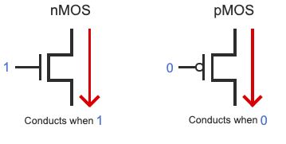
  - transistors as switches/Gates
    - **NOT Gate - inverter**
    - 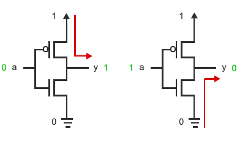
    - **AND Gate**
    - 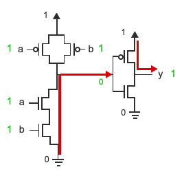
    - **OR Gate**
    - 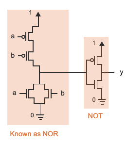
- ### Boolean Algebra
  - operators: `AND, OR, NOT, XOR, XNAND, ...`
  - Note: **Function defines exactly one output value for unique input values, and must include all input possibilities.**
- ### Handy tools
  - **Basic Properties**
    - 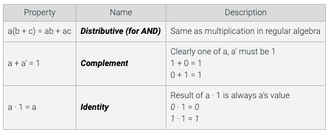
    - 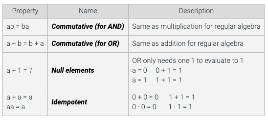
  - **Demorgan's Theorem**
    - `Y = (AB)' = A' + B'`
    - `Y = (A + B)' = A'B'`
  - **Consensus Theorem**
    - `AB + AC + B'C = AB + B'C`, *AC* is covered by the first and last term
    - `(A + B)(A + C)(B' + C) = (A + B)(B' + C)`, *A + C * is covered by the first and last term
      - proof:
        - Venn Diagrams
        - Boolean Algebra
            ```
            AB + AC + B'C
            = AB + AC * 1 + B'C             identity
            = AB + AC * (B + B') + B'C      complement
            = AB + ABC + AB'C + B'C         distributive
            = AB(1 + C) + (A + 1)B'C        distributive
            = AB + B'C
            
            (A + B)(A + C)(B' + C)
            = (A + B)(A + C + 0)(B' + C)
            = (A + B)(A + C + BB')(B' + C)
            = (A + B)(A + C + B)(A + C + B')(B' + C)
            = (A + B + 0 * C)(A * 0 + B' + C)
            = (A + B)(B' + C)
            ```
        - Logic Simulation (*Table*)
      - examples
        - `A + A'B` = `A + B`
        - `AB + A'CD` = `A + BCD`
        - `AB + A'CD + BCDE` = `A + BCD`
  - **Shannon's Expansion**
    - assumes a switching algebra system
    - divide a **switching function** into smaller functions
      - note: switching function considers ***two-value*** logic system
      - boolean algebra system considers ***multi-value*** logic system
    - pick a variable `x`, partition the switching function into two cases: `x = 1` and `x = 0`
        ```
        f(x, y, z, ...) = xf(x = 1, y,z, ...) + x'f(x = 0, y, z, ...)
        ```
    - example
      - `f(x) = xf(1) + x'f(0)`
        ```
        f(x) = x'
        f(x) = x * 1' + x' * 0'
        f(x) = 0 + x'
        ```
      - `f(x, y) = xf(1, y) + x'f(0, y)`
        ```
        f(x, y) = x + x'y
        f(x, y) = x * (1 + 1'y) + x' * (0 + 0'y)
        f(x, y) = x * 1 + x' * y
        f(x, y) = x + x'y
        ```
      - `f(a ,b, c) = a'b' + bc + ab'c`
        ```
        f(a ,b, c) = af(1, b, c) + a'f(0, b, c)
        f(a ,b, c) = a(1'b' + bc + b'c) + a'(0'b' + bc)
        f(a ,b, c) = a(bc + b'c) + a'(b' + bc)
        f(a ,b, c) = a((b + b')c) + a'(b' + bc + c)
        f(a ,b, c) = ac + a'(b' + c)
        f(a ,b, c) = ac + a'b' + a'c
        f(a ,b, c) = c + a'b'
        ```
      - Sums 
        ```
        f(x, y) = (x + f(x = 0, y))(x' + f(x = 1, y))
        ```
      - decompose the switching function into functions
        ```
        f(x, y) = xf(1, y) + x'f(0, y)
        = x(yf(1, 1) + y'f(1, 0)) + x'(yf(0, 1) + y'f(0, 0))
        = xyf(1, 1) + xy'f(1, 0) + x'yf(0, 1) + x'y'f(0, 0)
        ``` 
        ```
        f(x, y) = (x' + f(1, y))(x + f(0, y))
        = (x' + (y' + f(1, 1))(y + f(1, 0)) )(x + (y' + f(0, 1))(y + f(0, 0)) )
        ```
      - remark: *the choice of the variable for expansion is a nontrivial question*
- ### Specification
  - Binary addition
    - Half adder
      - input: a, b
      - output: sum, carry
      - switching expressions
        - sum(a, b) = a'b + ab'
        - carry(a, b) = ab
      - Arithmetic: 2c<sub>out</sub> + sum = a + b + c<sub>in</sub>
      - minterm - product
      - maxterm - addition
  - Incompletely Specified Function
    - do not care set is important because it allows us to min the function
      - either the input does not happen
      - or the input happens, but the output is ignored
    - Three types of output
      - F: on-set, output is 1
      - R: off-set, output is 0
      - D: don't-care-set: output can be either 1 or 0
    - Aim: **MIN # of terms, # of literals**
    - **K-Maps**
      - **adjacency** of miniterms (maxterms): *two miniterms are adjacent if they differ by only one vairable*
        - example
          - abc & a'bc: by consensus theorem, bc is the consensus
          - abc + a'b'c: consensus is bcb'c, which is 0, cannot use better expression, so they are NOT adjacent
          - abcde and a'bcde are adjacent
          - a'b'cde and abc'd'e' are not adjacent because their consensus is an **empty set**
      - Two-variable function 
        - `f(A,B)`
            
            |     | B=0  | B=1 |
            |-----|------|-----|
            | A=0 | A'B' | A'B |
            | A=1 | AB'  | AB  |

        - output table
            
            |     | B=0  | B=1 |
            |-----|------|-----|
            | A=0 | 0 | 1 |
            | A=1 | 1  | 1 |

        - Row A=1 is true and Column B=1 is true, so `f(A,B)=A+B`
        - For 2-variable functions, have 2 variables, 4 entries, 4 combinations
        - For n-variable functions, have n variables, 2<sup>n</sup> entries, 2<sup>n</sup> combinations
      - Three-variable function
        - `f(a,b,c)`
            
            |     | (0,0) | (0,1) | (1,0) | (1,1) |
            |-----|-------|-------|-------|-------|
            | c=0 | 0,1   | 2,1   | 6,1   | 4,1   |
            | c=1 | 1,0   | 3,0   | 7,0   | 5,0   |

        - So `f = c'` because `c=0` row has all true values
        - Note: adjacency applies here
          - m<sub>0</sub>, and m<sub>4</sub>, m<sub>1</sub> are adjacent
          - m<sub>0</sub> and m<sub>5</sub> are not adjacent because they differ by **2 variables**
      - **Boolean Algebra vs K-maps**
        - variables = planes
        - product terms = rectangles
        - miniterms = cells
        - consensus theorem = adjacency
      - Implicants, Prime Implicants, Essential Prime Implicants definitions
        - Implicants  
          - A product term that has non-empty insersection with on-set F and does not intersect with off-set R
        - Prime Implicants
          - An implicant that is **not covered** by any other implicants
        - Essential PI
          - A PI that has **an element in on-set F** but is **not covered** by any other PIs
        - **Note: Procedure of Finding Minimal POSs or SOPs**
          1. Find out all Essential PIs, fix the circles for those 1s
          2. For the rest 1s, find all possible PIs for each 
          3. The combinations of the PIs for each left 1s will be the final answer
      - Four-variable function
        - `f(a,b,c,d)`
          
          | cd&ab | 00 | 01 | 10 | 11 |
          |-------|----|----|----|----|
          | 00    | 1  | 0  | 0  | 1  |
          | 01    | 0  | 1  | 0  | 1  |
          | 10    | 1  | 1  | 0  | 0  |
          | 11    | 1  | 1  | 0  | 1  |

        - Procedure for finding the minimal function via K-maps
          1. Convert truth table to K-map
          2. Group the adjacent ones: include the largest number of adjacent ones(Prime)
          3. Create new groups to cover all ones in the map: include **essential prime implicants**
          4. Select the groups that result in the minimal sum of products
      - Five-variable function
        - **simply divide to 2 size of 16 K-maps, with `a=0` and `a=1`**
      - Six-variable function
        - **simply divide to 4 size of 16 K-maps, with `a=0 & b=0`, `a=0 & b=1`, `a=1 & b=0`, and `a=1 & b=1`**
- ### Universal Set of Gates
  - Motivation
    - AND, OR, NOT: basic logic gates
    - NAND, NOR: inverter of AND, OR
    - XOR: exclusive OR, prioirty check
  - Def: *A powerful concept to identify the coverage of a set of gates addorded by a given technology*
  - **Criterion**: If the set of gates can implement AND, OR, and NOT gates, then the set is universal
  - Examples
    - {AND, OR, NOT} - yes
    - {AND, NOT} - yes (Demorgan can produce OR gate)
      - `y = (a'b')' turns to y = a + b`
    - {OR, NOT} - yes (Demorgan can produce AND gate)
      - `y = (a'+b')' turns to y = ab`
    - `f(x, y) = xy'`
      - NOT: `f(1, a) = 1a' = a'`
      - Then we can implement a normal AND by inverting y in f(x, y)
      - Then by De Morgan, we can implement OR gate
    - {NAND, NOR}
    - {XOR} - Not a universal Gate
    - {XOR, AND} - XOR can implement NOT, so this is universal
  - **XOR: exclusive ORs**
    - x $\bigoplus$ y = xy' + x'y
      - commutative and associative also works on XOR
      - 1 $\bigoplus$ x = x', 0 $\bigoplus$ x = x
      - x $\bigoplus$ x = 0, x $\bigoplus$ x' = 1
      - each time using XOR, number of literals **double**
      - C<sub>out</sub> = ab + c(a $\bigoplus$ b)
  - **NAND, NOR Gates**
    - Inverter + AND/OR
    - So by De Morgan, NAND and NOR gates can be reduced to OR and AND gates
---
## **Sequential Nerworks (Midterm 2)**
- **memory** + **time steps (Clock)**
### **Introduction**
- Sequential circuits
  - def: *A circuit whose output depends on current inputs and past outputs* (A circuit with memory)
  - Key features
    - memory: flip flops
    - specification: finite state machines
    - implementation: excitation tables
    - main theme: timing
      - present time: `t`, next time: `t+1`
- Memory heirarchy
  - different types: smallest to largests
    - register/latches
    - register file (static memory - SRAM)
    - Cache memory (static memory - SRAM)
    - Main memory (Dynamic Memory - DRAM)
    - NVM Main memory (Non-volatile memory - e.g. Flash)
    - Disk
  - Trade-off between size and speed. **Smaller, faster.**
  - Size relates to 
    - storage density (area/bit)
    - power (power/bit)
- Basic Mechanism of Memory
- 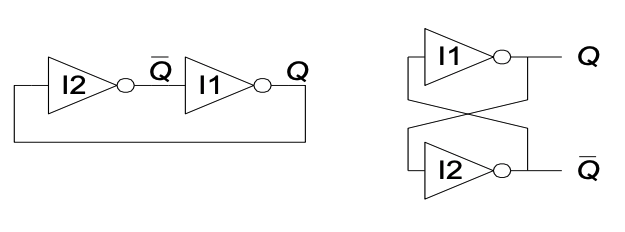
  - Capacitive Loads
  - these two circuits are essentially the same.
  - Two outputs: Q and Q_bar
  - There is a feedback loop
    - in a typical combinational logic, there is no feedback loop
  - No inputs
  - Two possible cases for this circuit
    - Q = 1, Q' = 0
    - Q = 0, Q' = 1
  - Bistable circuit stores 1 bit of state in the state variable, Q (or Q')
  - Hold the value due to capacitive charges and feedback loop strengthening
  - But **there are no inputs to control the state**
  - Given a memory component made out of a loop of inverters, the number of inverters in the loop has to be **even** (in order to keep consistency)
### **Basic Building Blocks**
- Latch
  - example: flight attendant call button
  - 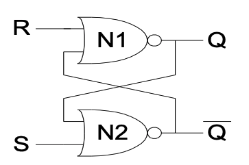
    - press call: light turn on, stays on after button released
    - press cancel: light turns off
    - SR latch implementation
      - call=1, sets Q to 1 and keeps it at 1
      - cancel=1, resets Q to 0
    - All possible cases
      - `S = 1, R = 0`
      - `S = 0, R = 1`
      - `S = 0, R = 0`
      - `S = 1, R = 1`
    - 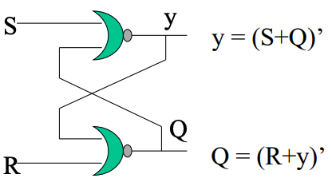
    - The truth table will be 
    - 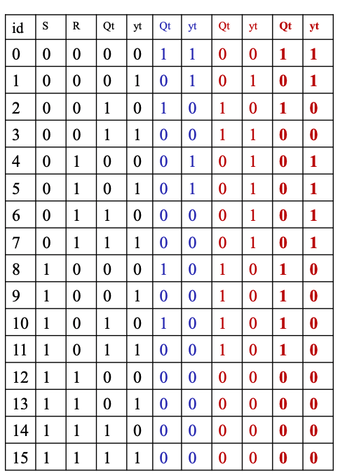
    - The state table will be 
    - 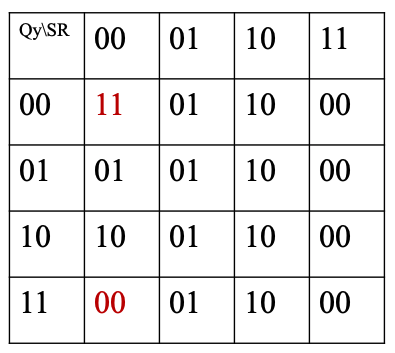
    - The state diagram will be 
    - 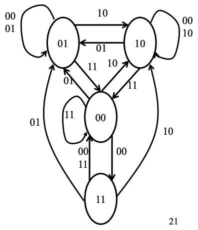
    - Tangling problem exists (state `11`)
- Moore Machine VS Mealy Machine
  - Mealy:
    - Transition format: input/output
    - example: S1 -- 1/0 --> S2
    - This means from state 1, if the input is 1, goes to state 2, and the output is 0
  - Moore:
    - Transition format: input
    - Outputs are carried by each state
    - example: S1(0) -- 1 --> S2(1)
    - This means from state 1, if the input is 1, goes to state 2, the output is 1
  - Diagram
  - 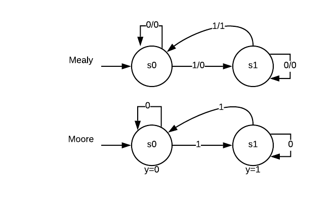
  - state diagram
    - Mealy
      - | s  | 0    | 1    |
        |----|------|------|
        | s0 | s0,0 | s1,0 |
        | s1 | s1,0 | s0,1 |
      - format: state, input 0, input 1
      - For each cell: next state, output of the transition
    - Moore
      - | s  | 0  | 1  | y |
        |----|----|----|---|
        | s0 | s0 | s1 | 0 |
        | s1 | s1 | s0 | 1 |
      - format: state, input 0, input 1, output y
      - For each cell: state
  - Conversion between Mealy and Moore
  - 
    - Note the transition that outputs 1 in Mealy Machine
    - For each output 1, we need an extra state in Moore Machine. Here we have s2
    - We look at the original pointed state in Mealy Machine, which is s0, because when we are at state 1 and the input is 1, we go to state 0.
    - In Mealy Machine, s0 goes to itself when input is 0, and to s1 when input is 1
    - Therefore, for the added state s2, it should go to s0 when input is 0, and to s1 when input is 1
### **Implementation**
### **Timing and Retiming**
- Motivation
  - Too late: Fail to reach for the setup of the next state
  - Too early: Race to disturb the holding of the next state
  - Gaol: a **Robust** design
  - A typical sequential network has combinational circuit between registers
  - The registers are synchronized by clocks
  - Timing is set between clocks
- Gate Delay
  - t<sub>cd</sub>: Min delay of a gate, also called Contamination delay
    - Minimum time from when an input changes until the output starts to change
  - t<sub>pd</sub>: Max delay of a gate, also called Propagation delay
    - Maximum time from when an input changes until the output is guaranteed to reach its final value
  - Different input transition causes different delay at output
  - Different path causes different output transition delay
  - Interconnect Delay
    - For 5GHz, the clock period is 200 𝑝𝑠/𝑐𝑦𝑐𝑙𝑒.
- Flip-Flop Timing Window
  - Timing: Setup Time and Hold Time Constraints
  - Once a flip flop has been ‘built’ we are stuck with its timing characteristics
    - t<sub>setup</sub>, t<sub>hold</sub> timing relation between `D and CLK`
    - t<sub>ccq</sub>, t<sub>pcq</sub> timing relation between `CLK and Q`
    - Note that **No direct timing relation between input D and output Q**
    - 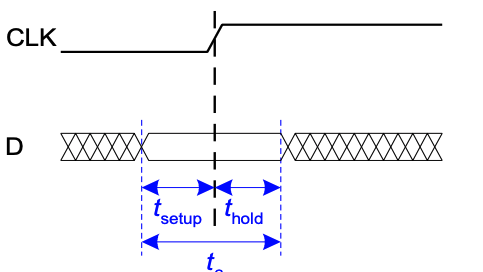
    - t<sub>setup</sub>
      - Time **before** the clock edge that data must be stable (i.e. not change)
      - Setup time violation
        -  occurs if the input signal D does not settle (set up) to the stable value at least t<sub>setup</sub> before the clock edge.
    - t<sub>hold</sub>
      -  Time **after** the clock edge that data must be stable
      -  Hold time violation 
         -  This occurs if the input signal D does not remain unchanged (hold) for at least t<sub>hold</sub> after the clock edge
    - 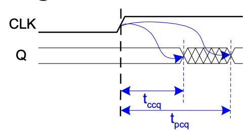
    - **Propagation** delay
      - t<sub>pcq</sub> = time after clock edge that the output Q is guaranteed to be stable (i.e., to stop changing)
    - **Contamination** delay
        - t<sub>ccq</sub> = time after clock edge that Q might be unstable (i.e., start changing)
- Two Timing Constraints: shortest and longest timing paths
  - 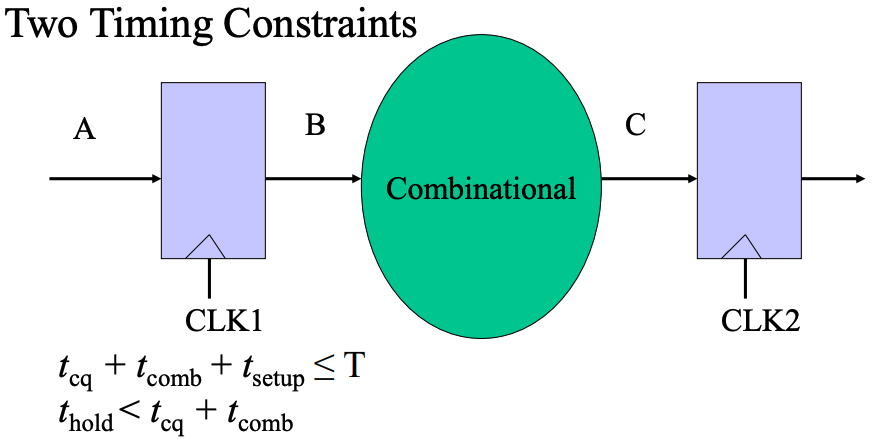
  - t<sub>cp</sub>: time from rising edge of clock to Q update `(CLK1 -> B)`
  - t<sub>comb</sub>: time of combinational logic delay  `(B -> C)`
  - t<sub>setup</sub>: setup time before rising edge of clock `(C -> CLK2)`
  - t<sub>hold</sub>: hold time after the rising edge of clock `(CLK1 -> CLK2)`
  - **T**: clock period `(CLK1 -> CLK2)`
  - **SO**
    - Setup time constraint - Longest delay from CLK1 to CLK2
      - 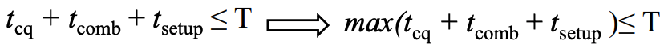
    - Hold time constraint - Shortest delay from CLK1 to CLK2
      - 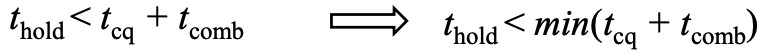
- Examples
  - 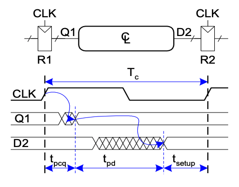
  - **Setup Time Constraint**
  - Suppose CLK rises at t1, what is the maximum delay (from t1) after which D2 reaches a stable value
    - Note that setup time constraint depends on the **maximum** delay from register R1 through the combinational logic
    - The input to register R2 must be stable at least t setup before the clock edge.
    - **t<sub>pcq</sub> + t<sub>pd</sub> + t<sub>setup</sub> ≤ T**
    - **t<sub>pd</sub>** here is all the delays of combinational logics.
  - 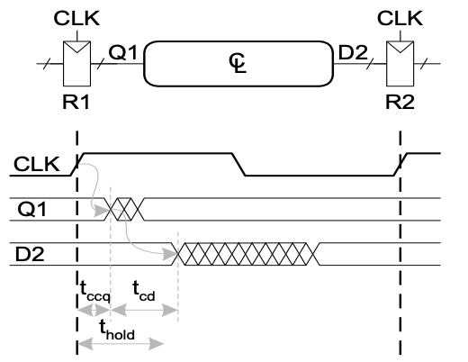
  - **Hold Time Constraint**
    - **t<sub>hold</sub> < t<sub>ccq</sub> + t<sub>cd</sub>(Comb)**
- Clock Skews and Retiming
  - def: 
    - *The clock doesn’t arrive at all registers at the same time. The difference between two clock edges is skew*
    - Caused by **p**rocess variation, **v**oltage fluctuation, **c**rosstalks (PVC)
  - In the worst case, CLK2 is 
    - Eaerlier than CLK1 for setup time: t<sub>CLK2</sub> = t<sub>CLK1</sub> - t<sub>skew</sub>
    - Later than CLK1 for hold time: t<sub>CLK2</sub> = t<sub>CLK1</sub> + t<sub>skew</sub>
    - Then, 
      - 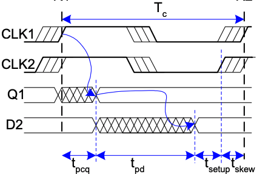
      - T<sub>c</sub> ≥ t<sub>pcq</sub> + t<sub>pd(Comb)</sub> + t<sub>setup</sub> + t<sub>skew</sub>
      - 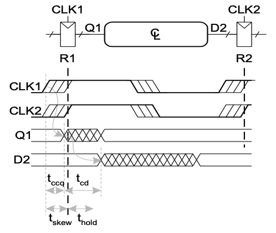
      - t<sub>ccq</sub> + t<sub>cd(Comb)</sub> > t<sub>hold</sub> + t<sub>skew</sub>
  - Designated Skew
    - Make skew by design to improve the performance.
    - t<sub>CLK2</sub> = t<sub>CLK1</sub> + t<sub>skew</sub>
    - T<sub>c</sub> ≥ t<sub>pcq</sub> + t<sub>pd(Comb)</sub> + t<sub>setup</sub> **-** t<sub>skew</sub>
    - t<sub>ccq</sub> + t<sub>cd(Comb)</sub> > t<sub>hold</sub> + t<sub>skew</sub>
    - So, usually when we are considering MIN clock period T, we evaluate the MAX value of t<sub>skew</sub> we can get to make **Hold time constraint** hold.
    - Examples
      - T<sub>c</sub> ≥ 215 **-** t<sub>skew</sub>
      - 30 + 50 ≥ 70 + t<sub>skew</sub>
      - Then the MIN period T can be 205.
  - Retiming: 
    - Adjust the clock skew so that the clock period can be reduced.
---
## **Standard Modules**
### Introduction
### Decoder
- def: *A digital module that converts a binary **address** to the assertion of the addressed **device***
  - N inputs, 2<sup>N</sup> outputs
  - **One-hot outputs: only one output HIGH at most**
- Logic Diagram
- 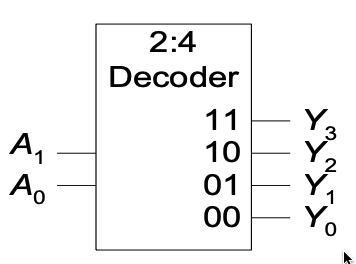
- Application
  - Decoder produces **minterms** when E = 1
  - Universal set: {Decoder, OR}
  - Example
    - F1(a, b, c) = ∑m(1, 2, 4) + ∑d(0, 5)
    - F2(a, b, c) = ∑m(2, 3) + ∑d(1, 4)
    - F3(a, b, c) = ∑m(0, 5, 6)
- Tree of Decoders
  - Scale up the size of decoders using a tree structure
  - Using one decoder to select children decoders
  - Example
    - when input `a = 1`, select decoder 1; otherwise select decoder 2.
    - More specifically, implement a 4-2<sup>4</sup> with 3-2<sup>3</sup> decoders
    - Implement a 6-2<sup>6</sup> with 3-2<sup>3</sup> decoders
      - 3 inputs to decode 8 different decoders, each of which also has 3 inputs
### Encoder
- def: *A digital module that converts the assertion of a device to the binary address of the device.*
  - At most one I<sub>i</sub> = 1.
  - (y<sub>n-1</sub>, ..., y<sub>0</sub>) = 1 if I<sub>i</sub> = 1 & E = 1
  - (y<sub>n-1</sub>, ..., y<sub>0</sub>) = 0 otherwise
  - A = 1 if E = 1, and one i such that I<sub>i</sub> = 1 (The address is **valid**)
  - A = 0 otherwise (The address is **invalid**)
- Logic Diagram
- 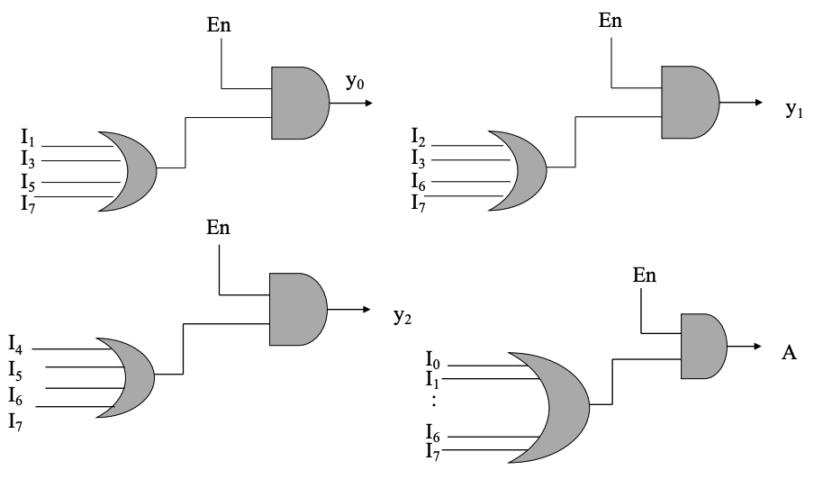
- Priority Encoder
  - Input (I<sub>2^n-1</sub>, ..., I<sub>0</sub>), output (y<sub>n-1</sub>, ..., y<sub>0</sub>)
  - (y<sub>n-1</sub>, ..., y<sub>0</sub>) = i if I<sub>i</sub> = 1 and E = 1 and I<sub>k</sub> = 0
  - where for all k > i (higher priority) or all k < i (lower priority)
  - 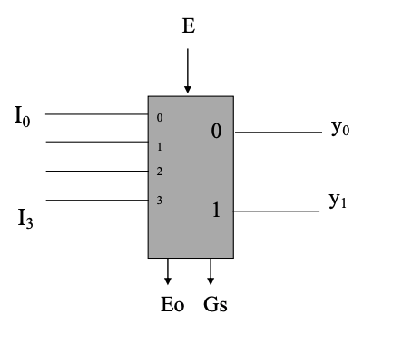
### Multiplexer (Mux)
- def: *A digital module that selects one of data inputs according to the binary address of the selector.* 
  - If E = 1
    - y = D<sub>i</sub> where i = (S<sub>n-1</sub>, ..., S<sub>0</sub>)
  - Else
    - y = 0
  - Selects between one of N inputs to connect to the output
  - log<sub>2</sub>N-bit select input - control input
  - - 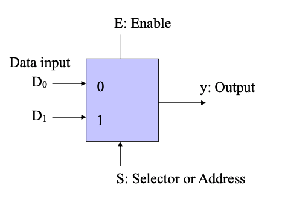
  - Example: 2:1 Mux
  - 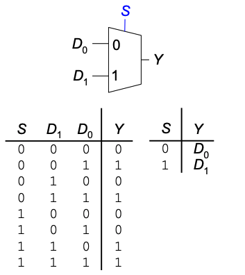
- Logic Diagram
  - logic gates: SOP
  - 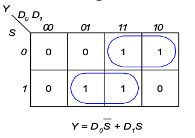
- Application
  - Universal Set: {Mux}
    - Use selector to decompose the function into smaller functions, which follows **Shannon's Expression**
    - Simplify the decomposed functions using K-map, which follows **consensus theorem**
  - Building Blocks of FPGA (Field Programmable Gate Array)
### Demultiplexier (DeMux)
---
## **Data Path Subsystem (Final)**
---
## **Control Subsystem (Final)**
