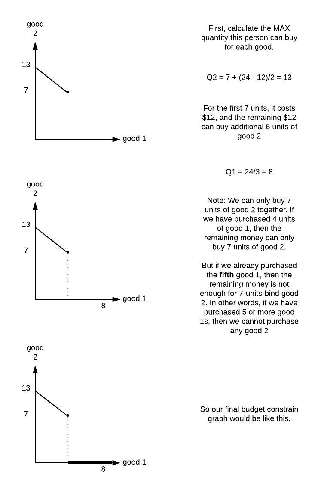
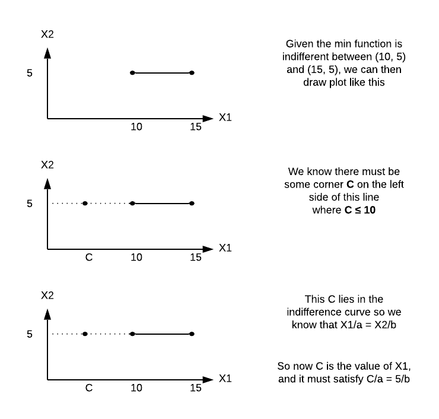
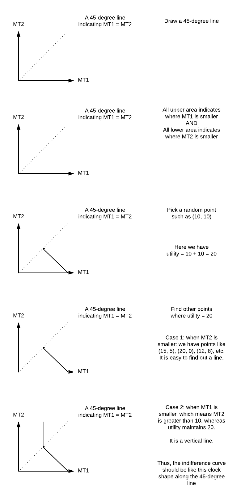
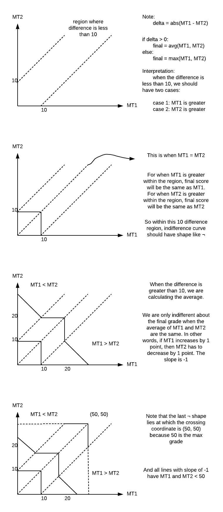

# ECON 100A
---
- ### Elasticity
  - `E = % ∆y / % ∆x`: between two points
  - `E = ∂f(x) * x / f(x)`: at one specific points
  - Example:
    1. `Q = a - bp` 
       - EQ,p = -b * p / (a - bp)

    2. `Q = 7*p`
       - slope = 7, EQ,p = 7 * p / (7*p) = **1**
       - constant, always gets the same value
       - functions of the form f(x) = c * xß have **constant** elasticity, `E = ß`

  - If a function has a constant elasticity, then it is a power function
  - Example questions:
     1. If the **elasticity** of supply is 0.75, and a price change has caused the quantity supplied to go down by 9%, what must be the percentage price change?
        - EQ,P = Δ% quantity / Δ% price
        - `0.75 = -9% / Δ% price`
        - `Δ% price = -12%`
        
     2. If the **elasticity** of demand for poutine with respond to income is -0.5, the initial income is $40K per year, and they are initially purchasing 50 plates per year. How many plates will be purchased if the income rises to $56K per year?
        - e = -0.5
        - EQ,I = Δ% quantity / Δ% income
        - `Δ% of income = (56 - 40) / 40 = 40%`
        - `-0.5 = Δ% quantity / 40%`
        - `Δ% quantity = -20%`
        - new quantity = 50 * (1 - 20%) = 40
     
     3. Give a specific exmaple of a linear function `f(x) = a + bx` such that the value of the function is 2 when x = 1 and the **elasticity** of this function is 1 when `x = y`.
        - condition one: `a + b = 2`
        - condition two: `E = f'(x) * x / f(x)` → `E = b = 1`
        - Thus, `a = 1`, and `b = 1`
        - Function will be `f(x) = x + 1`
      
     4. How would adding a positive constant to a function f(x) affect its **elasticity**? Given f is strictly positive, strictly increasing x > 0.
        - `E = f'(x) * x / f(x)`
        - Adding a constant does **not** change `f'(x)` but **increases** `f(x)`
        - Thus, the term `x / f(x)` will decrease. E will decrease.
     
     5. Could a pair of functions, f and g, satisfy both of the following conditions at the same time. If **YES**, give an example; if **NO**, explain why not.
        
        i. f'(7) > g'(7) > 0

        ii. 0 < Ef(x), x(7) < Eg(x), x(7), f(7) > 0, g(7) > 0
        
        - 0 < f'(7) * x / f(7) < g'(7) * x / g(7)
        - f(x) = x, g(x) = x2/100

- ### Properties of indifference curve map
  1. bundles on indifference curves further from the origin are preferred over those on indifference curves closer to the origin
  2. indifference curves do not cross
  3. indifference curves slope downward
  - Hard question
    - give an exmaple of consumer preference over (x, y) where x > 0, y > 0 satisfying **completeness, transiticity, and "more is better" assumptions**, for which each indifference curve contain a single bundle (binary bundle,either A or B, never be indifferent)
      - (x1, y1) > (x2, y2) if x1 + y1 > x2 + y2
      - TODO

- ### Utility Functions
  - summarizes a consumer's preference by assigning a numerical value to each possible bundle
  - x ≥ y is equivalent to U(x) ≥ U(y)
  - any positive monotonic transformation of U leaves consumer preferences unchanged
  - F is a positive monotonic transformation if for any x > y, F(x) > F(y)
    - U = x + y
    - U = 2x + y does not work because y is not multiplied by a constant
    - U = 2(x + y), fine
    - U = (2(x + y) + 3)3, fine
  - Then, the indifference curve is a level curve of the utility function
    - U_bar = u(q1, q2)
  - Cobb Douglas 
    - U = √(q1, q2)
    - q2 = U_bar2/q1

# TODO
- Two Extreme versions of downward-sloping convex indifference curves
  1. Perfect Substitutes
     - You will get a 45 degree line
     - `MRS = -1`, one for one substitution
     - `MRS = -4`, one for four substitution
     - Note: **MRS is the same regardless of the value of x or y**
  2. Perfect complements are the goods that are consumed in fixed proportions
     - You will get a 90 degree angle, slope 0 and $\infty$
     - Example: 
       - cars (X) and tires (Y)
       - remote (X) and batteries (Y)
  - u(q1, q2) = min(aq1, bq2)
    - Do not have access of either good, if aq1 = bq2) 
  - Sometimes it is possible to determine consumer's preference over a few bundles and how they rate other bundles
  - Question preferences
    - there exists one commodity which shifts the indifference curve **outward (shift up or right)** as consumption of it increases without changing their **slope**
    - u(q1, q2) = u(q1) + q2
      - u(q1) increasing and concave
      - example:
        - u(q1, q2) = √q1 + q2
        - u(q1, q2) = ln(q1) + q2
      - MRS = -(u'(q1)/1) = -u'(q1)
      - A more detailed MRS explaination is [here](https://github.com/yeelimtse/UCSD-review-docs/blob/master/others/What%20is%20MRS.md)
- ### **Quasilinear Preferences**
  - u(q1, q2) = q1 + u(q2)
  - MRS = MRS = -1/u'(q2), depends on q2 only
  - Consumer preferences
    - A, B are two consumers
    - todo
- ### **Budget Constrain**
  - budget I, price p1 and p2
  - bundle (q1, q2) is feasible if p1\*q1 + p2\*q1 ≤ I(ncome)
  - budget constraint p1\*q1 + p2\*q1 = I
    - q1 = I/p1 - p2q2/p1
    - q2 = I/p2 - p1q1/p2
  - MRT (Marginal Rate of Transformation) - the slope of budget constrain
    - **slope: -p1/p2**
  - Example
    - I = 60, p2 = 5
    - p1 = 10 on the first 3 units, p1 = 6 on all units after 3
    - Graph the budget constrain,
      - For p2, I/p2 = 60/5 = 12
      - For p1
        - the first 3 units, spend $30, I/p1 = 30/10 = 3
        - the following, p1 = 6, I/p1 = 30/6 = 5
      - Therefore, have two different slopes, 
        - slope1 = -2
        - slope2 = -6/5
  - **Unconstrained** Optimization
    - Want to MAX `f(x1, x2, ..., xn)`
    - Then 
      - f(1)(x1, ...) = 0, derivative of x1
      - f(2)(x1, ...) = 0, derivative of x2
      - f(3)(x1, ...) = 0, derivative of x3
      - etc...
    - Example
      - Max `(x1+2x2)(6-2x1-x2)`
      - f(1)(x1, ...) = 6 - 4x2-x2-4x1 = 0
      - f(2)(x1, ...) = 12 - 4x1 - 4x2 - x1 = 0
      - 4x1+5x2 = 6
      - 5x1+4x2 = 12
      - x1 = 4
      - x2 = -2
  - **Constrain** Optimization
    - Max f(x1, x2), with constrain **g(x1, x2) = c**
    - level curves of f, there are infinitely many level curves, but only one that can **MAX**
    - When level curve is MAX, the constrain has to be tangent to the level curve of the function
    - slope: **-g1(x1, x2)/g2(x1, x2)** = **-f1(x1, x2)/f2(x1, x2)**
      - This means that there exists some **scalar λ such that**
      - **λg1(x1, x2) = f1(x1, x2)** and **λg2(x1, x2) = f2(x1, x2)**
    - For cases of multiple variables, if want to Max f(x1, ..., xn) such that g(x1, ..., xn) = c, the solution (x1*, ..., xn*) should satisfy that 
      - f1(x1, ..., xn) = λg1(x1, ..., xn)
      - etc.
- ### **Lagrangian Function**
  - **L(x1, ..., xn, λ) = f(x1, ..., xn) + λ(c-g(x1, ..., xn))**
  - λ is a **Lagrangian Multiplier**
    - **Unconstrained** Max of L function
      - f1(x1, ..., xn) - λg1(x1, ..., xn) = 0
      - f2(x1, ..., xn) - λg2(x1, ..., xn) = 0
      - ... 
      - fn(x1, ..., xn) - λgn(x1, ..., xn) = 0
      - Thus, derivative of **f = c - g(x1, ..., xn)**
    - **Constrained** Max of L function
      - Max U(x1, x2)
      - Constrain: p1x1 + p2x2 = I
        - L = U(x1, x2) + λ(I - p1x1 - p2x2)
        - derivative respective to x1 = U1(x1, x2) - λp1 = 0
        - derivative respective to x2 = U2(x1, x2) - λp2 = 0
        - Combine these two equations, we have
          - U1(x1, x2)/p1 = U2(x1, x2)/p2
## **Review**
1. Describe all points where MRS of **x1x22** is -1.
 - **Answer:**
   - **MRS = -x22/(2x1x2) = -x2/x1 = -1**
2. A consumer spends `$72` on a good when the price of this good is `$6`. When its price increases to `$8`, the consumer spend $64 on it. What is the price elasticity of demand?
 - **Answer:**
    - Denote that both the P and Q have changed, to calculate the price elasticity between two points, we need to calculate the percentage change
    - Given point `(72, 72/6), and (64, 64/8)`
    - We know the origin Q is 72/6 = 12, and the current Q' is 64/8 = 8. `%delta of Q = (8 - 12)/12 = -1/3`
    - P = 6, and P' = 8. `%delta of P = (8 - 6)/6 = 1/3`
    - By the definition of elasticity, we have `e = %delta of Q / %delta of P = -1`
3. A person have income `I=24`, and price of good 1 is $3. Note that a consumer needs to pay `$12` to get 7 units of good 2, and `$2` for each additional unit of good 2. Graph the budget constrain and label all important points.
  - **Answer:**
    - 
4. Given **min(x1/a, x2/b)** is indifferent between `(10, 5)` and `(15, 5)`. What can you say about coefficient `a and b`?
  - **Answer:**
    - 
    - Based on our calculation, given `C/a = 5/b` and `C ≤ 10`, we have
    - `C = 5a/b`, plug `C ≤ 10` in, then we have
    - `5a/b ≤ 10`, so the eventual relation is `a ≤ 2b`
5. Given Utility = MT1 + min(MT1, MT2), graph indifferent curve.
  - **Answer:**
    - Naive Procedure: *plot multiple points such as (0, 1), (0, 5), (0, 10), etc, and find out the pattern*
    - 
## **Practice Midterm-1**
1. todo
2. todo
3. todo
4. todo
5. In the Potions class at Hogwarts School of Witchcraft and Wizardry there are two midterms, each out of 50 points. To get the Önal class score, the following procedure is applied: if the di§erence between the midterm scores is less than or equal to 10, then the Önal score is the maximum of the two midterms. If the di§erence between the midterm scores is greater than 10, then the Önal score is the average of the two midterms. In the space below, draw the indi§erence curves for the midterm scores. To get the full credit, you need to draw all possible shapes that exist here. Put MT1 score on the horizontal axis. Label all important points.
- **Answer:**
  - 