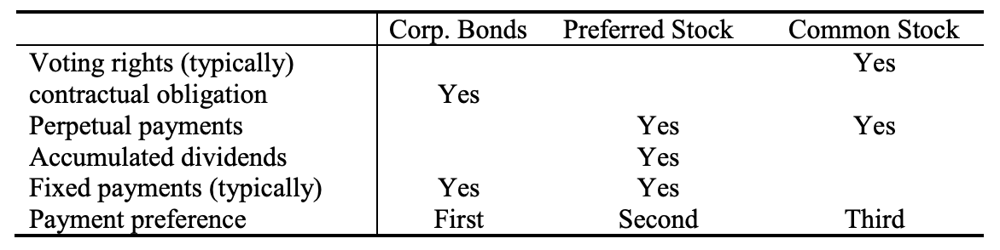

# **Econ 173A Financial Markets**
---
## **Chapter 2**
1. Preferred stock VS. long-term debt & equity
   - Preferred stock is like long-term debt in that it typically promises a **fixed** payment each year.
   - Preferred stock is also like long-term debt in that it does not give the holder **voting rights** in the firm. 
   - Preferred stock is like equity in that the firm has no obligation to make the preferred stock **dividend payments**. 
2. Money market securities refers to "cash equivalents"?
   - **Because of their high level of liquidity**.
   - The prices of money market securities are very stable, and they can be converted to cash (i.e., sold) on very **short** notice and with very **low** transaction costs.
3. a
   - A repurchase agreement is an agreement whereby the seller of a security agrees to “repurchase” it from the buyer on an **agreed** upon date at an **agreed** upon price. (`"We had a deal"`)
4. If the economy were to enter a steep recession, what do you expect to happen to the **spread** between **yields on commercial paper and T-bills**?
   - Spreads between risky commercial paper and risk-free government securities will **widen**.
   - Deterioration of the economy increases the likelihood of default on commercial paper, making them more risky. 
   - Investors will demand a greater premium on all risky debt securities, not just commercial paper
5. Corporate bonds VS. Common Stock VS. preferred stock
   - 
6. 
---